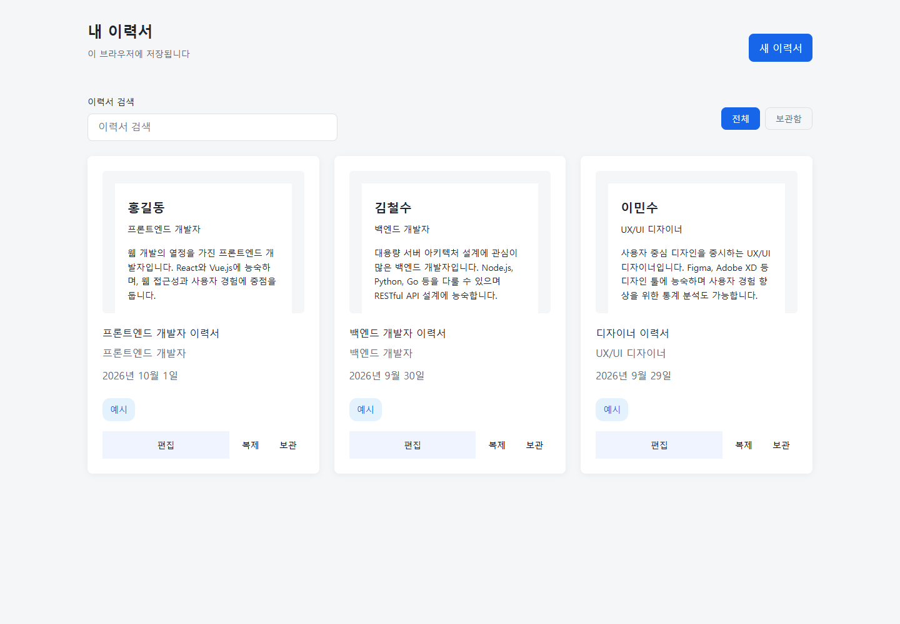

# Local evaluation results

Measured on 2026-10-02 using the version 3 resume fixture checks in this repository.

These are historical, operator-assisted results. **7/19 and 8/19 failed most checks, and 19/19 did not establish autonomous reliability.** The follow-up [unattended study](UNATTENDED-RESULTS.md) records fresh-generation failures separately.

| Candidate | Passed | Evidence |
| --- | ---: | --- |
| Original local workflow | 7/19 | [Report](results/baseline/report.json) |
| Initial compact skill generation | 8/19 | [Report](results/initial-skill/report.json) |
| Iterative repairs and visual refinement | 19/19 | [Report](results/final/report.json) |

All three saved candidates were evaluated with the same final check suite. This is one application fixture, not a controlled model benchmark. Configuration, prompts and repair workflow changed between candidates. Passing checks does not establish general intelligence, comprehensive security or parity with the complete upstream Round 09 product.

## Environment and method

- Windows, Intel Core i5-12600K, 32 GB RAM, NVIDIA RTX 3080 Ti with 12 GB VRAM.
- Ollama 0.35.0, OpenCode 1.18.33, Node 24.19.0, Playwright 1.58.2 with installed Chrome.
- Qwen3 Coder 30B for generation; Qwen3.5 9B for constrained local repairs. The final workflow used a 32768-token context and an 8192-token output budget.
- Codex inspected failures and screenshots, improved the harness, and supplied concrete visual observations and focused repair requests. Application edits came from local model responses, with deterministic removal of parsed code comments. This was an assisted iterative run, not an unattended one-shot success.
- Repairs included rejected truncated, ambiguous and ineffective responses. Some accepted edits regressed functionality and required subsequent repairs. No convergence guarantee is implied.

The checks cover saved files, JavaScript syntax, three example documents, visible labels, creation and reload persistence, independent duplication, archive/restore, creation after editing, required-title validation, user text rendering, comment absence, runtime errors, typography and horizontal overflow at 1440 and 390 pixels.

## Visual review

The inspected final desktop and mobile screenshots improve the initial metadata-only cards with paper previews, a left-aligned heading, distinct edit actions and usable stacked mobile cards. The paper-preview structure follows observations from the upstream Round 09 reference. Search/filter ordering and detailed typography still differ; the reduced fixture does not implement the full upstream editor. Full reference equivalence remains unverified, and the machine report deliberately retains `visualReview: UNVERIFIED`.



[Final mobile screenshot](results/final/mobile.png)

## Reproduce the final artifact

The runnable source is in [examples/resume](../examples/resume). From the repository root:

```sh
npm ci
npx playwright install chromium
node scripts/evaluate.mjs examples/resume runs/recheck
```

This command verifies the saved artifact without calling a model. For new generation, failure-driven repair and visual refinement, follow the [README](../README.md). No private machine paths or raw model-session logs are included in the published evidence.
